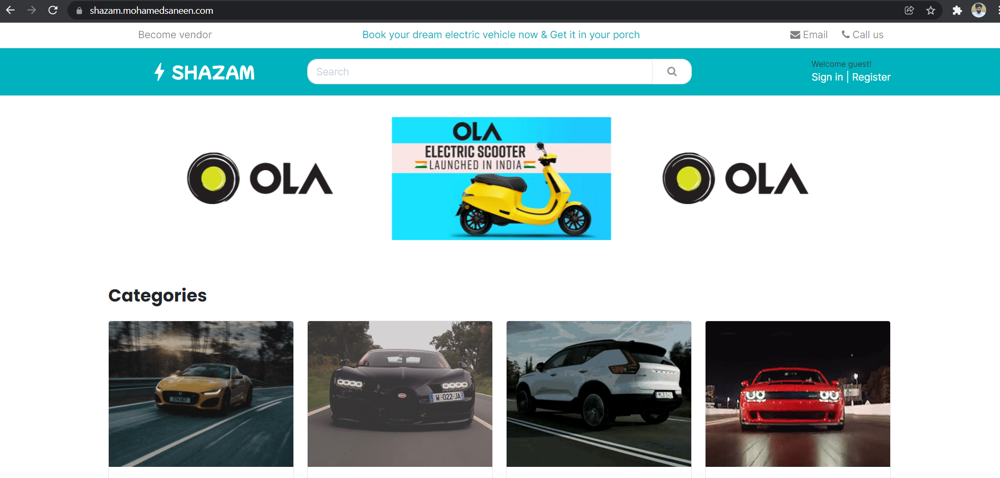
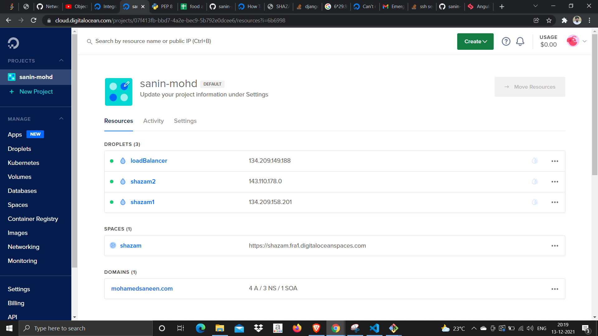
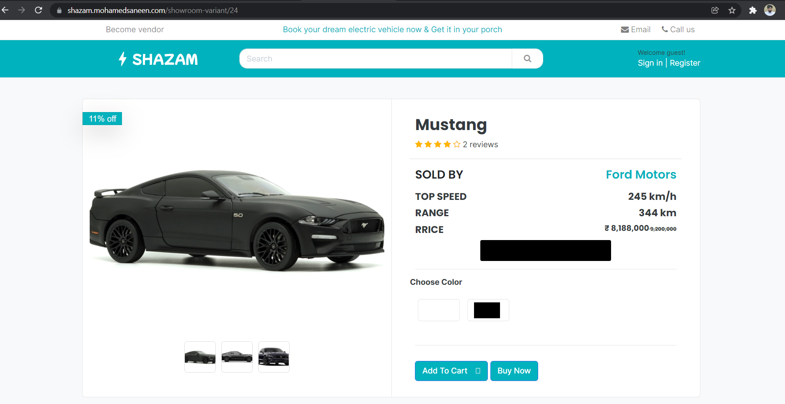

# shazam
A Django Web app which help customers to participate in  EV pre-booking  ,vendor can display vehicles and admin can control vendors and customers(multi-vendor app)

HOSTED in digital ocean using 2 servers 1 proxy server  and 1 s3 for storing static files.

<h4>1. Home</h4>

<h4>2. Vendor dashboard</h4>

<h4>3. admin dashboard</h4>

<h4>4. Servers,loadbalancer and s3</h4>

<h4>5. Showroom</h4>

